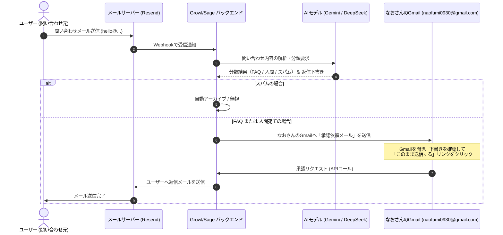

# Support AI (問い合わせAI) 設計書 ＆ ロードマップ (Gmail承認版)

本ドキュメントは、`hello@growl-ai.com` に届く問い合わせメールに対し、AIが自動で分類・下書き作成を行い、なおさんが使い慣れた **Gmail（メール）** 上でワンタップ承認・送信できる「Human-in-the-Loop型サポートAI」の設計書および開発ロードマップです。

---

## 1. コアコンセプト
AIに完全な自動返信を任せるのではなく、**「AIが下書きを作成し、なおさんがご自身のGmailで最終確認・承認して送信する」**仕組みとします。これにより、誤回答（ハルシネーション）を100%防ぎながら、LINEやTelegramなどの別アプリを開くことなく、メールチェックのついでに1タップで返信を完了させます。

- **Gmail完結型フロー**: なおさんの個人Gmail宛てに届いた「承認用メール」のリンクをクリックするだけで、返信メールがユーザーへ送られます。
- **マルチリンガル対応**: 日本語・英語両方の問い合わせに対し、同一システムで自然に言語判定・自動返信生成を行います。
- **3ステップ処理**:
  1. 受信 ➔ AIによる自動分類と返信案の生成。
  2. 承認 ➔ なおさんのGmailに要約と下書き、[このまま送信する] リンクを記載したメールを送信。
  3. 送信 ➔ リンクがクリックされたら、Resend / Gmail APIを介してユーザーへ送信。

---

## 2. システムの流れ (シーケンス)



---

## 3. 詳細設計

### 3.1. メール分類 (Triage) ルール
受信したメールを以下の3つのカテゴリに自動分類します。

| カテゴリ | 判定基準 | 処理アクション |
| :--- | :--- | :--- |
| **FAQ (AI解決可能)** | アプリの使い方、価格プラン、診断の受け方、連携方法など、既存のドキュメントで回答できるもの。 | AIが回答下書きを生成し、なおさんに承認依頼メールを送信。 |
| **HUMAN (人間宛て)** | 協業の提案、取材依頼、決済の不具合、個別コンサル依頼など。 | なおさんへ「手動返信用メール」を送信。下書きは作成せず、直接手動で対応いただくためのリンクを提示。 |
| **SPAM (無視)** | 営業メール、自動送信される配信不能通知、明らかなスパム。 | 自動アーカイブ。通知は行わない。 |

### 3.2. Gmail 承認用メールのフォーマット例
なおさんのGmailに届く承認メールのレイアウトイメージです。

```text
件名: 【GrowlサポートAI】承認待ちの問い合わせがあります

📩 新規問い合わせが届きました。

■ 差出人: Tanaka Tarou <tanaka@example.com>
■ 件名: 診断結果のPDFについて
■ 本文: 
「診断結果ページのPDFダウンロードボタンが動作しません。」

------------------------------------
💡 【AI返信下書き案】
「お問い合わせありがとうございます。Growlサポートです。
診断結果のPDFダウンロードにつきまして、現在ブラウザのポップアップブロックが有効になっている場合にダウンロードが開始されない問題を確認しております。お手数ですが、ブラウザの設定をご確認いただくか、...」
------------------------------------

【アクションをお選びください】
👉 [このまま送信する] (クリックすると、ユーザーへ上記の返信が即座に送られます)
👉 [Growl管理画面で編集する] (Growlのダッシュボードを開き、編集して送信します)
```

---

## 4. 開発ロードマップ

### Phase 1: メール受信 ＆ 分類基盤の構築
- `hello@growl-ai.com` への受信メールをWebhookで受け取るエンドポイントの実装。
- DeepSeek / Gemini APIを使用した「メールの自動分類」及び「要約」エンジンの構築。
- スパムメールの自動フィルタリング機能。

### Phase 2: Gmail承認フローの実装
- AI下書き生成後、なおさんのGmail宛てに「承認用リンク付きHTMLメール」を送信する処理の実装。
- 承認用URLを受け取るAPI（`POST /api/support/approve`）の実装。
- 「承認」が実行された際に、Resend経由でユーザーへメールを自動送信する仕組みの統合。
- Supabaseへの問い合わせチケット保存とステータス管理。

### Phase 3: RAG (知識ベース) 連携
- 問い合わせに対して、関連する社内知識やFAQデータを自動で引き出して返信下書きに埋め込む仕組み。
