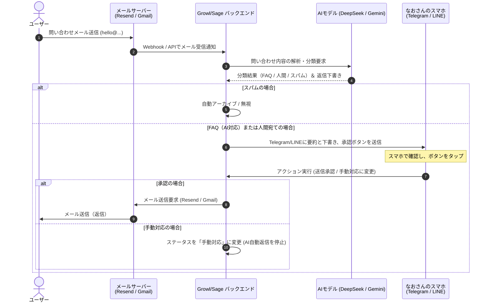

# Support AI (問い合わせAI) 設計書 ＆ ロードマップ

本ドキュメントは、`hello@growl-ai.com` に集約される問い合わせメールに対し、AIが自動分類・下書き作成を行い、人間（なおさん）のメッセンジャー（Telegram / LINE）経由でワンタップ承認・送信できる「Human-in-the-Loop型マルチリンガルサポートAI」の設計書および開発ロードマップです。

---

## 1. コアコンセプト
AIに完全な自動返信を任せるのではなく、**「AIが下書きを作成し、人間がメッセンジャー（スマホ）から最終確認・承認して送信する」**仕組みとします。これにより、誤回答（ハルシネーション）を100%防ぎながら、運用の手間を最小限（1タップ）に抑えます。

- **マルチリンガル対応**: 日本語・英語両方の問い合わせに対し、同一システムで自然に言語判定・自動返信生成を行います。
- **3ステップ処理**:
  1. 受信 ➔ AIによる自動分類（Triage）と返信案の生成。
  2. 承認 ➔ なおさんのTelegram / LINEに「分類・要約・下書き」を通知し、インラインボタンで承認を求める。
  3. 送信 ➔ ボタンが押されたら、Resend / Gmail APIを介してユーザーへ送信。

---

## 2. システムアーキテクチャ



---

## 3. 詳細設計

### 3.1. メール分類 (Triage) ルール
LLMに対し、受信したメールを以下の3つのカテゴリに分類させます。

| カテゴリ | 判定基準 | 処理アクション |
| :--- | :--- | :--- |
| **FAQ (AI解決可能)** | アプリの使い方、価格プラン、診断の受け方、連携方法など、既存のドキュメントで回答できるもの。 | AIが回答下書きを生成し、なおさんに承認依頼。 |
| **HUMAN (人間宛て)** | 協業の提案、取材依頼、決済の不具合、個別コンサル依頼、あるいは「人間に代わってほしい」という明示的要望。 | なおさんへ即時通知（優先度高）。下書きは作成せず、手動返信用リンクを提示。 |
| **SPAM (無視)** | 営業メール、自動送信される配信不能通知、明らかなスパム。 | 自動アーカイブ。通知は行わない。 |

### 3.2. Telegram / LINE 通知フォーマット例
なおさんのスマホに届く通知のレイアウト設計案です。

```text
📩 【新規問い合わせ】分類: FAQ (AI回答可)
------------------------------------
■ 差出人: Tanaka Tarou <tanaka@example.com>
■ 言語: 日本語
■ 要約: 診断結果ページのPDFダウンロードボタンが動作しない。

💡 【AI返信下書き案】
「お問い合わせありがとうございます。Growlサポートです。
診断結果のPDFダウンロードにつきまして、現在ブラウザのポップアップブロックが有効になっている場合にダウンロードが開始されない問題を確認しております。お手数ですが、ブラウザの設定をご確認いただくか、...」

[🟢 このまま送信]  [✏️ 編集して送信]  [👤 手動で対応する]
```

*※インラインボタン（TelegramのCallback Query / LINEのPostback Action）を使用することで、アプリを開かずにメッセンジャー内で直接メール返信をトリガーできます。*

### 3.3. データベース設計 (Supabase)
問い合わせ履歴とステータスを管理するテーブル設計案です。

```sql
create table support_tickets (
  id uuid default gen_random_uuid() primary key,
  sender_email text not null,
  sender_name text,
  subject text,
  body_text text not null,
  language varchar(10) default 'ja',
  category varchar(20), -- 'FAQ', 'HUMAN', 'SPAM'
  status varchar(20) default 'pending_approval', -- 'pending_approval', 'sent', 'manual', 'ignored'
  ai_summary text,
  ai_draft text,
  created_at timestamp with time zone default timezone('utc'::text, now()) not null,
  updated_at timestamp with time zone default timezone('utc'::text, now()) not null
);
```

---

## 4. 開発ロードマップ

### Phase 1: メール受信 ＆ 分類基盤の構築 (初期)
- `hello@growl-ai.com` への受信メールをWebhookで受け取るエンドポイント（`POST /api/support/webhook`）の実装。
- DeepSeek または Gemini APIを使用した「メールの自動分類（Triage）」及び「要約」エンジンの構築。
- スパムメールの自動フィルタリング機能。

### Phase 2: メッセンジャー承認フローの実装 (中期)
- Sageの既存Telegram / LINE通知モジュールを拡張し、インラインアクションボタン付きの通知送信処理を実装。
- コールバックAPIのエンドポイント（`POST /api/support/callback`）の実装。
- 「承認」ボタンが押された際に、Resend API経由でユーザーへメールを自動返信する仕組みの統合。

### Phase 3: RAG (知識ベース) 連携と自動学習 (後期)
- `SAGE_MASTER_CONTEXT.md` や `LearnAI.html` 内の講義データ、Q&AドキュメントをベクターDB（ChromaDB等）に格納。
- 問い合わせに対して、関連する社内知識を自動で引き出して返信下書きに埋め込むRAGシステムの導入。
- なおさんが下書きを「編集して送信」した差分をAIが学習し、以降の返信精度を高めるフィードバックループの構築。
